# SQL-Data-Cleaning

## Data Cleaning Using MS SSMS and Excel on Nashville Housing Dataset

Ques : What is Data Cleaning?
Ans : Data cleaning is the process of fixing or removing incorrect, corrupted, incorrectly formatted, duplicate, or incomplete data within a dataset.

This Dataset consists of following columns like 'UniqueID', 'ParceID', 'LandUse', 'PropertyAddress', 'Saledate', 'Saleprice', 'LegalRefernce', 'SoldAsVacant', 'OwnerName', 'OwnerAddress' and much more...

## Steps to do Data Cleaning on this Dataset using SQL Queries :

1. Downloading the Dataset in Excel format on to the local machine from the source.
2. Loading the Dataset on the MS SSMS using SQL Server 2019 Import and Export Data(32-bit).
3. Then, configuring the database to get the table in database and running SQL Queries to clean the data.
4. Getting the new cleaned data from the raw data to get better insights.

## Nashville Housing Dataset in Excel

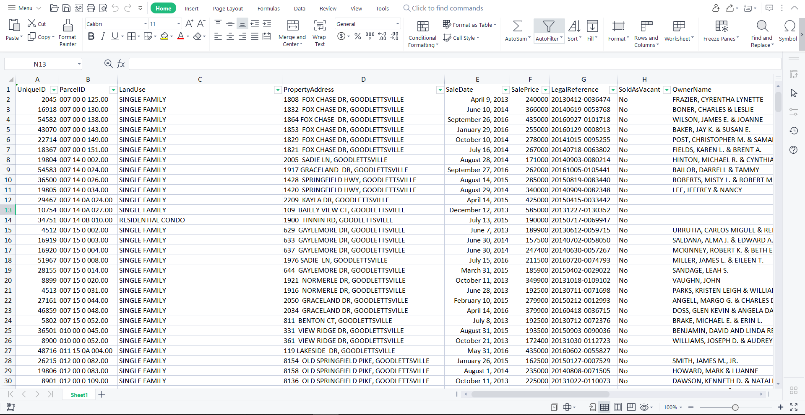

In this project, cleaned the Nashville Housing Excel data in MS SQL Server Management Studio such as Date Format, Property and Owner Address , Changed the SoldAsVacant column from Y to Yes and No to N, Removed Duplication of data using CTE and deleted unused columns

## Loaded the Excel data to SQL Server

### Showing all the data using SQL Query

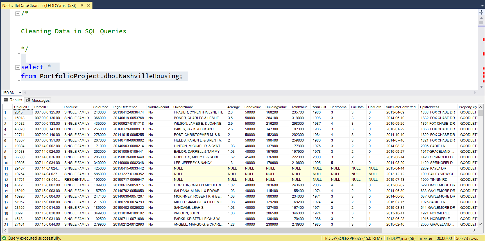

### Standardize Date Format

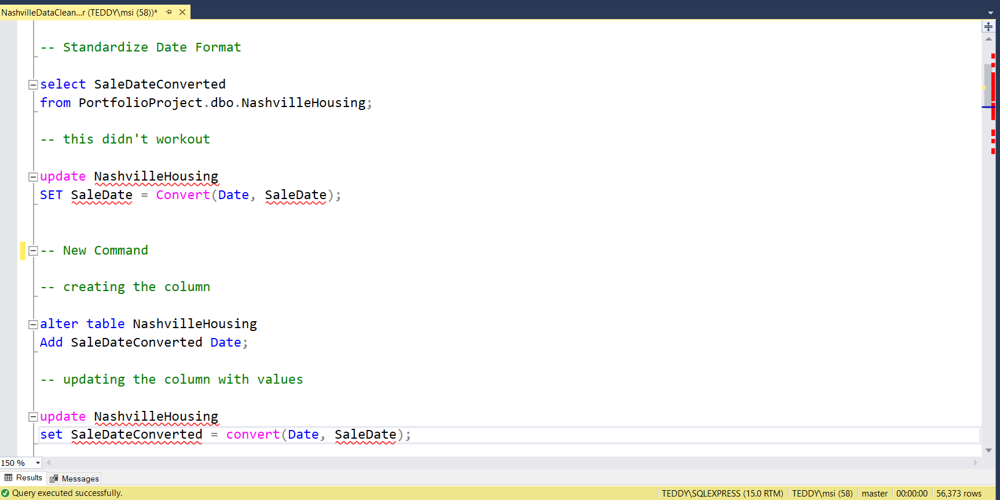

Altering the table and updating new SaleDate Values in the column

### Populate Property Address

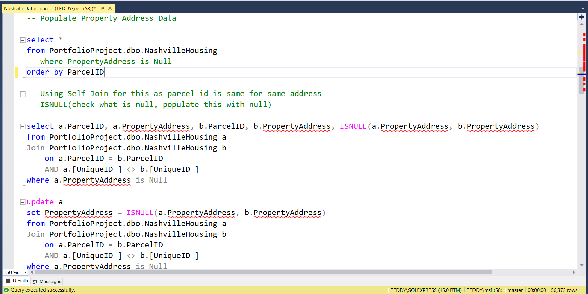

### Breaking Out property address

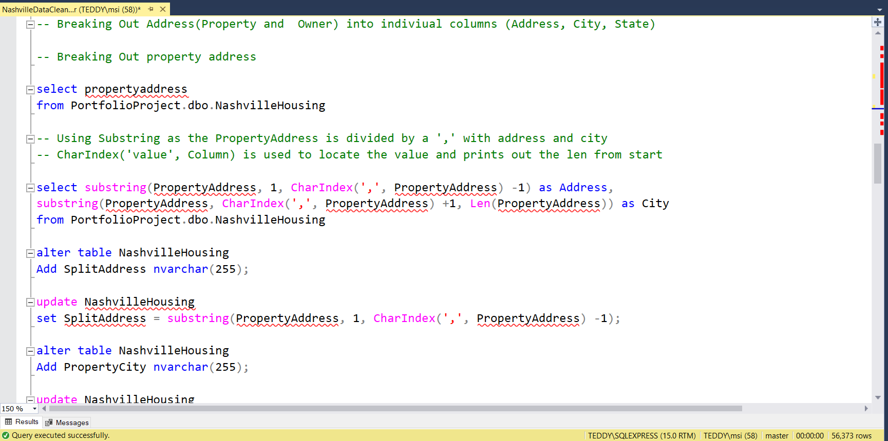

Using self join and Breaking Out Address(Property and Owner) into indiviual columns (Address, City, State)

### Breaking Out Owner Address Not using Substring but using ParseName(replace(), LastValue)

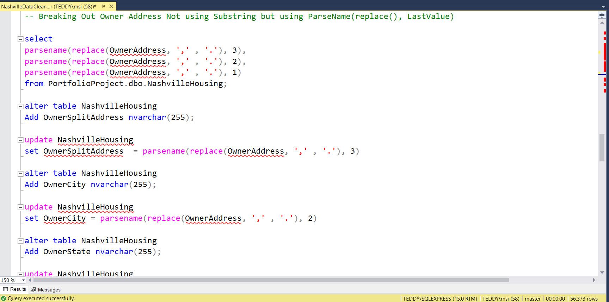

### Changed Y and N to Yes and No in "Sold as Vacant" field

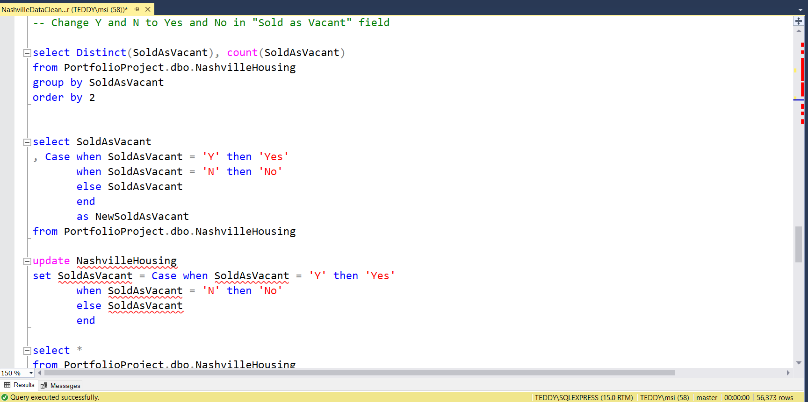

### Remove Duplication

Using windows functions

CTE : common table expression (CTE) is a temporary named result set that you can reference within a SELECT, INSERT, UPDATE, or DELETE statement. You can also use a CTE in a CREATE a view, as part of the view’s SELECT query. In addition, as of SQL Server 2008, you can add a CTE to the new MERGE statement. 

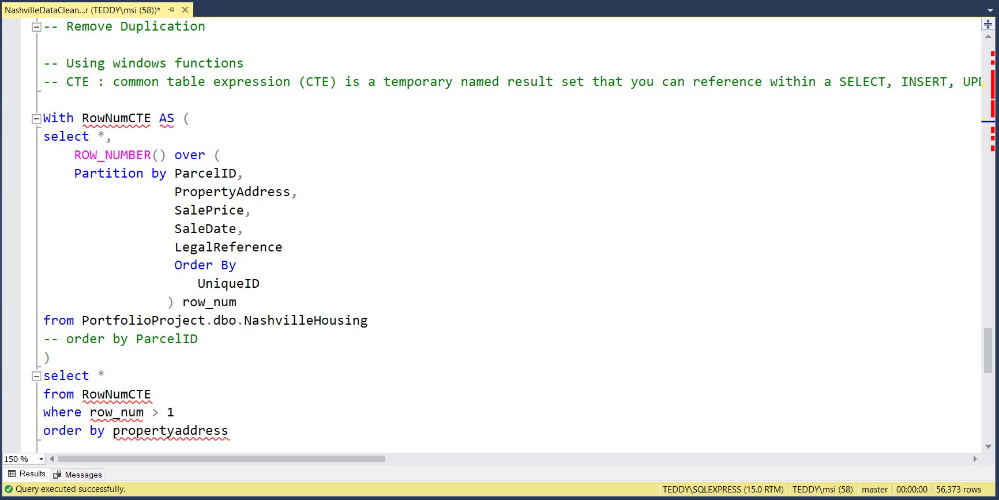

### Deleting Unused Columns

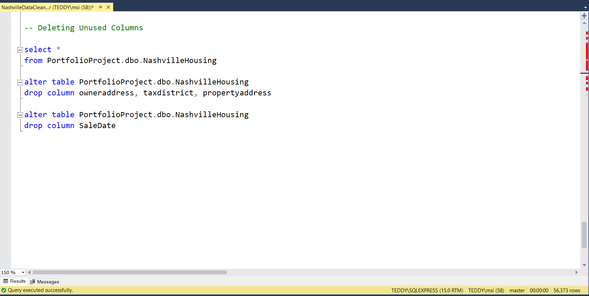

### Results after cleaning the data using SQL Queries

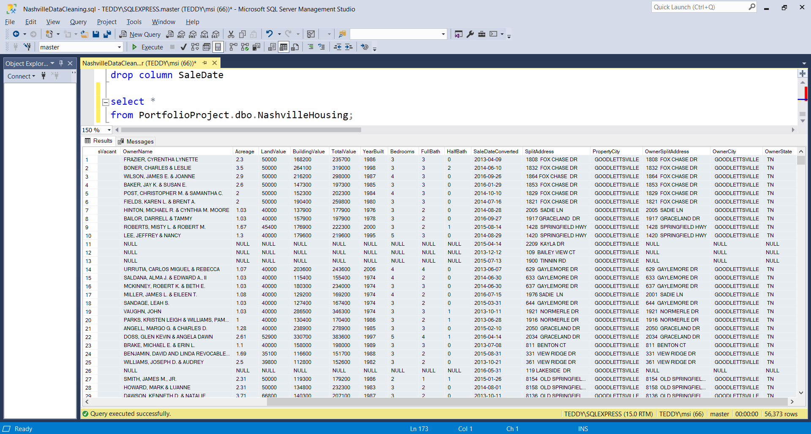

### New Dataset in Excel after cleaning the data in SQL Server

The New Columns of the dataset are the 'SaleDateConverted', 'SplitAddress', PropertyAddress', 'PropertyCity', 'OwnerSplitAddress', 'OwnerCity', 'OwnerState' and changed the 'SoldAsVanact' all Y to 'Yes' and N to 'NO'

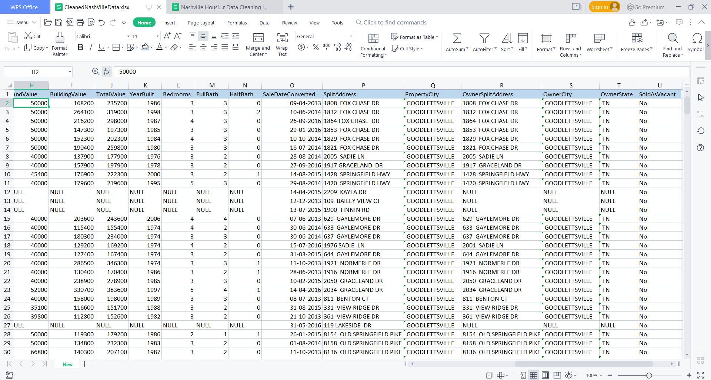

In This project, successfully cleaned the raw data of Nashville Housing Dataset using Excel and SQL Server Managemenet Studio to get the New Excel Sheet.
